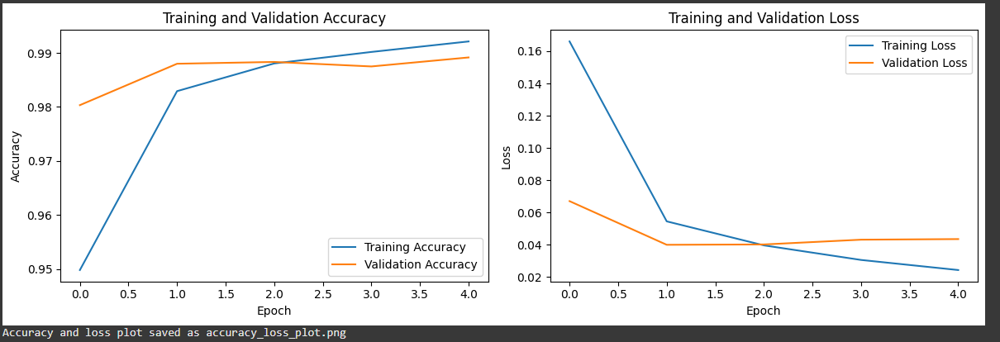
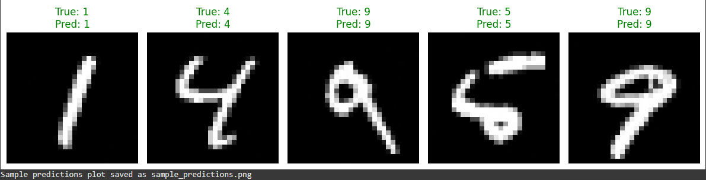

# 🧠 Noisy MNIST Digit Classifier using CNN

This project demonstrates how to build a robust deep learning model that can classify handwritten digits from the MNIST dataset even after adding noise. By simulating noisy conditions, the model is trained to handle real-world distortions effectively.

---

## 🔍 Project Steps

### ✅ Step 1: Load and Explore the MNIST Dataset  
Loaded the original dataset and visualized a few sample digits.

### 🎯 Step 2: Add Gaussian Noise  
Added controlled Gaussian noise to all MNIST images to simulate distortion.

### 🧹 Step 3: Preprocess the Data  
Normalized pixel values, reshaped the data, and split it into training and testing sets.

### 🧠 Step 4: Design the CNN Architecture  
Created a simple yet powerful Convolutional Neural Network using TensorFlow/Keras.

### ⚙️ Step 5: Train the Model  
Trained the model using categorical cross-entropy loss and Adam optimizer.

### 📈 Step 6: Evaluate the Model  
Evaluated model performance using accuracy and confusion matrix.

### 📊 Step 7: Accuracy and Loss Visualization  
To monitor model performance during training, accuracy and loss values were recorded at each epoch. The following plot helps understand how well the model learned from the noisy MNIST dataset.



### 🔍 Step 8: Sample Model Predictions  
After training, the model was tested on unseen noisy images. Below are a few examples of the model's predictions along with their actual labels.



---

## 🛠️ Technologies Used

- Python 3  
- Google Colab / Jupyter Notebook  
- TensorFlow / Keras  
- NumPy, Matplotlib, Seaborn

---

## 📁 File Structure

```
robust-digit-recognition/
├── Mnist_with_noise_deep_learning (1).ipynb   # Main notebook
├── Requirements.txt                          # Python dependencies
├── README.md                                  # Project description
├── accuracy_loss_plot.png                     # Accuracy and loss graph
├── sample_predictions.png                     # Model prediction outputs
```

---

## 🚀 How to Run This Project

1. Clone this repository:
   ```bash
   git clone https://github.com/Codewithjhansi/robust-digit-recognition.git
   ```

2. Open the notebook:
   ```
   Mnist_with_noise_deep_learning (1).ipynb
   ```

3. Install required dependencies:
   ```bash
   pip install -r Requirements.txt
   ```

---

## 🔮 Future Enhancements

- Add different types of noise (salt & pepper, blur)
- Experiment with deeper CNNs or transfer learning models
- Save the model and deploy as a web app using Streamlit or Flask

---

## 🏷️ Tags

`#DeepLearning` `#CNN` `#MNIST` `#NoisyData` `#ImageClassification` `#TensorFlow` `#Python`

---

## 📬 Contact

**Author:** @Codewithjhansi  
📎 **GitHub:** [https://github.com/Codewithjhansi](https://github.com/Codewithjhansi)

---

## 🙌 Final Note

This project helped me explore how deep learning models perform under noisy conditions, pushing the boundaries of basic CNN classification. I'm excited to keep learning, improving, and building smarter solutions from here.

Thanks for reading! 😊

**— Jhansi (@Codewithjhansi)**

---


